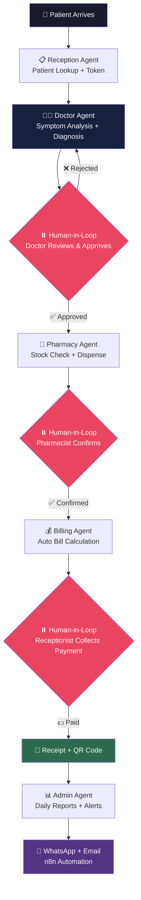
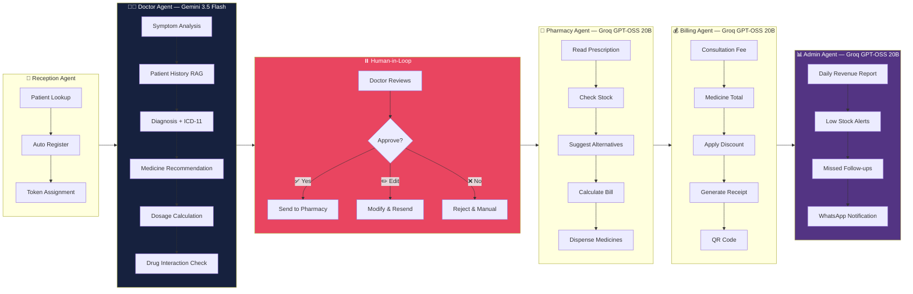

<h1 align="center">🏥 HMS AI</h1>

<h3 align="center">⚡ Engineered by <strong>Joyel J</strong> · <a href="https://github.com/ELBynx-AI">ELBynx AI</a></h3>

<br/>

<p align="center">
  
  
  
  
  
</p>

<p align="center">
  
  
  
  
  
</p>

<p align="center">
  
  
  
  
  
</p>

<p align="center">
  
  
  
  
  
</p>

---

> 🏥 **HMS AI** is a next-generation, AI-powered Hospital Management System that leverages **Multi-Agent LangGraph Orchestration** with **Google Gemini 3.5** and **Groq GPT-OSS 120B** to autonomously generate diagnoses, prescriptions, drug interaction checks, and complete billing workflows — all with mandatory **human-in-loop doctor approval** before any action. Built for the 6,00,000+ small clinics in India that still use paper registers. Engineered by **Joyel J** at **ELBynx AI**, Nagercoil, Tamil Nadu 🇮🇳.

---

## 📌 Table of Contents

- [🧠 System Architecture](#-system-architecture)
- [🤖 Multi-Agent Architecture](#-multi-agent-architecture)
- [⚡ Features](#-features)
- [🔄 Patient Flow](#-patient-flow)
- [📦 Tech Stack](#-tech-stack)
- [🔧 Installation](#-installation)
- [🚀 API Endpoints](#-api-endpoints)
- [🔐 Roles & Access Control](#-roles--access-control)
- [🤖 AI Agent Details](#-ai-agent-details)
- [💰 Plans & Pricing](#-plans--pricing)
- [🗺️ Roadmap](#️-roadmap)
- [📋 Development Progress](#-development-progress)
- [🤝 Contributing](#-contributing)
- [📄 License](#-license)

---

## 🧠 System Architecture



---

## 🤖 Multi-Agent Architecture



---

## ⚡ Features

### Core Features (Basic Plan)

| 🔖 Feature | 📝 Description |
|---|---|
| 🆔 **Unique Patient ID** | Auto-generated P-0001 format IDs per clinic |
| 🔐 **Multi-Role Authentication** | JWT + bcrypt with Admin, Doctor, Receptionist, Pharmacist, Superadmin |
| 🏥 **Multi-Tenant Architecture** | One system, multiple clinics — complete data isolation via `clinic_id` |
| 👤 **Patient Management** | Register, search (by ID/phone/name), full patient history |
| 📋 **Appointment Queue** | Auto token numbering, real-time status tracking, daily queue management |
| 📝 **Visit Notes** | Doctor records complaints, diagnosis, notes, follow-up dates per visit |
| 💊 **Medicine Inventory** | Add medicines, track stock, low-stock alerts, restock management |
| 📜 **Smart Prescriptions** | Auto quantity calculation (frequency × duration), timing, multi-medicine support |
| 💊 **Pharmacy Module** | View pending prescriptions, edit quantity, add extra medicines, auto stock reduction |
| 💰 **Billing System** | Registration fee + consultation fee + medicine total — auto calculated, discount support |
| 📊 **Clinic Settings** | Admin configures fees per clinic — registration, consultation, follow-up |
| 💳 **Payment Collection** | Cash / UPI / Card — status tracking, daily revenue dashboard |
| 📥 **Data Export** | One-click Excel download — 4 sheets (Patients, Visits, Prescriptions, Bills) with styled headers |
| 🔄 **Dual Role Support** | Admin can also act as Doctor — perfect for solo clinics |

### AI Features (Premium Plan)

| 🔖 Feature | 📝 Description |
|---|---|
| 🤖 **Doctor Agent** | LangGraph multi-step agent: symptom analysis → diagnosis → prescription — powered by Gemini 3.5 Flash |
| 💊 **Pharmacy Agent** | Auto stock check, bill calculation, alternative medicine suggestions — Groq GPT-OSS 20B |
| 📋 **Reception Agent** | Smart patient lookup, auto registration, token assignment |
| 💰 **Billing Agent** | Auto fee calculation, receipt generation, QR code dispatch |
| 📊 **Admin Agent** | Daily revenue reports, low stock alerts, missed follow-ups — sent via WhatsApp |
| ⏸️ **Human-in-Loop** | AI suggests, human approves — EVERY agent requires human confirmation before any action |
| 🔍 **Patient History RAG** | pgvector embeddings for semantic search across patient visit history |
| 📷 **Lab Report Analysis** | Upload photo/PDF → AI extracts and analyzes values — Gemini multimodal |
| 💊 **Medicine Recommendation** | AI suggests medicines ONLY from clinic's own inventory — zero hallucination design |
| 📋 **Visit Summarizer** | AI summarizes last N visits for quick doctor review |
| 🛡️ **Drug Interaction Check** | AI checks all prescribed medicines for dangerous interactions before approval |
| 📊 **Prescription Audit Log** | Every AI suggestion + doctor action logged — full legal traceability |

---

## 🔄 Patient Flow

```
Reception → Doctor → Pharmacy → Billing
```

| Step | Action | Who | AI Agent |
|---|---|---|---|
| 1️⃣ | Patient arrives, registration/lookup | Receptionist | 🤖 Reception Agent |
| 2️⃣ | Token assigned, added to queue | Receptionist | Auto token system |
| 3️⃣ | Doctor examines, types symptoms | Doctor | 🤖 Doctor Agent generates prescription |
| 4️⃣ | Doctor reviews AI suggestion | Doctor | ⏸️ Human-in-Loop — Approve/Edit/Reject |
| 5️⃣ | Prescription sent to pharmacy | System | Automatic |
| 6️⃣ | Pharmacist checks stock, dispenses | Pharmacist | 🤖 Pharmacy Agent — stock + bill |
| 7️⃣ | Bill calculated, patient pays | Receptionist | 🤖 Billing Agent — auto calculation |
| 8️⃣ | Receipt generated with QR code | System | Automatic |
| 9️⃣ | Daily report sent to admin | System | 🤖 Admin Agent — WhatsApp alerts |

---

## 📦 Tech Stack

<p align="center">
  
  
  
  
  
  
  
  
  
  
  
  
  
  
  
  
  
  
</p>

| Layer | Technology | Purpose |
|---|---|---|
| **Backend** | FastAPI (Python 3.11) | High-performance REST API |
| **Database** | PostgreSQL 18 | Relational data — patients, prescriptions, billing |
| **Vector DB** | pgvector | Patient history embeddings for RAG pipeline |
| **ORM** | SQLAlchemy | Python ↔ Database mapping |
| **Validation** | Pydantic | Request/response schema validation |
| **Auth** | JWT + bcrypt | Secure token-based authentication |
| **Frontend** | React + Tailwind CSS | Modern responsive UI |
| **AI — Doctor** | Google Gemini 3.5 Flash | Medical reasoning, diagnosis, prescription generation |
| **AI — Agents** | Groq GPT-OSS 120B / 20B | Fast inference for pharmacy, reception, billing agents |
| **Agent Framework** | LangGraph | Multi-agent orchestration with state management |
| **RAG Framework** | LangChain | Document intelligence, patient history search |
| **Automation** | n8n | Scheduled tasks — reminders, reports, WhatsApp alerts |
| **Data Export** | openpyxl | Excel export with styled headers, 4-sheet workbook |
| **Deployment** | Docker + Cloudflare Tunnel | Containerized, SSL-secured, self-hosted |

---

## 🔧 Installation

### Option 1: Local Development

```bash
# 1️⃣ Clone the HMS AI repository
git clone https://github.com/JoyelJames/clinicflow-ai.git

# 2️⃣ Navigate into the project directory
cd clinicflow-ai

# 3️⃣ Create and activate conda environment
conda create -n clinicflow python=3.11
conda activate clinicflow

# 4️⃣ Install all required dependencies
pip install -r requirements.txt

# 5️⃣ Create the database
psql -U postgres -c "CREATE DATABASE hms_db;"

# 6️⃣ Set up environment variables
cp .env.example .env
# Edit .env with your credentials

# 7️⃣ Run the server
uvicorn app.main:app --reload

# 🌐 Access API docs at:
# http://localhost:8000/docs
```

### Option 2: Docker Deployment

```bash
# 🐳 Build the HMS AI image
docker build -t hmsai:latest .

# 🚀 Run with docker-compose
docker-compose up -d

# 📋 Check logs
docker-compose logs -f

# 🛑 Stop
docker-compose down
```

---

## 🚀 API Endpoints

### 🔑 Authentication
```
POST   /auth/login                          Login and get JWT token
```

### 👤 Patients
```
POST   /patients/register                   Register new patient (auto P-0001 ID)
GET    /patients/search?query=              Search by ID, phone, or name (ilike)
GET    /patients/all                        Get all clinic patients
```

### 📋 Appointments
```
POST   /appointments/book                   Book appointment (auto token number)
GET    /appointments/today                  Today's queue (ordered by token)
PUT    /appointments/{id}/status            Update status (waiting/with_doctor/done)
GET    /appointments/stats/today            Today's stats
```

### 📝 Visits
```
POST   /visits/create                       Create visit note (doctor/admin only)
GET    /visits/patient/{patient_id}         All patient visits
GET    /visits/patient/{patient_id}/last2   Last 2 visits (quick history)
```

### 💊 Medicine Inventory
```
POST   /medicines/add                       Add medicine (admin/pharmacist)
GET    /medicines/all                       Get all active medicines
GET    /medicines/search?query=             Search medicines (ilike)
GET    /medicines/low-stock                 Low stock alert list
PUT    /medicines/{id}/update               Update name, unit, price
PUT    /medicines/{id}/restock              Add to existing stock (+=)
```

### 📜 Prescriptions
```
POST   /prescriptions/create               Create prescription (auto quantity = freq × duration)
GET    /prescriptions/patient/{patient_id}  Patient's prescriptions
GET    /prescriptions/pending               Pending prescriptions (for pharmacy)
```

### 💊 Pharmacy
```
GET    /pharmacy/pending                    Pending prescriptions list
GET    /pharmacy/prescription/{id}          View prescription details (with in_stock flag)
POST   /pharmacy/dispense/{id}             Dispense (edit qty, add extras, stock reduces)
```

### 💰 Billing
```
POST   /billing/create                      Create bill (auto-calculate all fees)
POST   /billing/{bill_id}/pay              Collect payment (cash/upi/card)
GET    /billing/pending                     Pending bills
GET    /billing/today/revenue               Today's revenue dashboard
```

### 📊 Admin
```
POST   /admin/staff/create                  Create staff account
GET    /admin/staff/all                     Get all clinic staff
PUT    /admin/staff/{id}/deactivate        Deactivate staff
POST   /admin/settings/fees                 Set clinic fees
```

### 👑 Superadmin
```
POST   /superadmin/clinic/create            Create clinic + admin account together
GET    /superadmin/clinics/all              Get all clinics
PUT    /superadmin/clinic/{id}/deactivate   Deactivate clinic
```

### 📥 Export
```
GET    /export/all                          Download Excel (4 sheets, styled headers)
```

### 🤖 AI Agent
```
POST   /ai/doctor/generate                  Generate AI prescription (LangGraph + Gemini)
```

---

## 🔐 Roles & Access Control

| Endpoint | 👩‍💼 Receptionist | 👨‍⚕️ Doctor | 💊 Pharmacist | 🏥 Admin | 👑 Superadmin |
|---|---|---|---|---|---|
| Register patient | ✅ | ✅ | ❌ | ✅ | ❌ |
| Book appointment | ✅ | ✅ | ❌ | ✅ | ❌ |
| Write visit notes | ❌ | ✅ | ❌ | ✅ | ❌ |
| Create prescription | ❌ | ✅ | ❌ | ✅ | ❌ |
| Add medicines | ❌ | ❌ | ✅ | ✅ | ❌ |
| Dispense medicines | ❌ | ❌ | ✅ | ✅ | ❌ |
| Collect payment | ✅ | ❌ | ❌ | ✅ | ❌ |
| Manage staff | ❌ | ❌ | ❌ | ✅ | ❌ |
| Set clinic fees | ❌ | ❌ | ❌ | ✅ | ❌ |
| Create clinics | ❌ | ❌ | ❌ | ❌ | ✅ |
| Export data | ❌ | ❌ | ❌ | ✅ | ✅ |
| Use AI Agent | ❌ | ✅ | ❌ | ✅ | ❌ |

---

## 🤖 AI Agent Details

### Multi-Model Strategy

| Agent | Model | Provider | Purpose |
|---|---|---|---|
| 🧠 **Doctor Agent** | Gemini 3.5 Flash | Google AI | Diagnosis, prescription, drug interaction check |
| 💊 **Pharmacy Agent** | GPT-OSS 20B | Groq | Stock verification, bill calculation, alternatives |
| 📋 **Reception Agent** | GPT-OSS 20B | Groq | Patient lookup, auto-registration, token management |
| 💰 **Billing Agent** | GPT-OSS 20B | Groq | Fee calculation, receipt generation |
| 📊 **Admin Agent** | GPT-OSS 20B | Groq | Daily reports, low stock alerts, WhatsApp notifications |

### Safety Constraints

```
🔒 STRICT RULES — Every Agent:

 1. AI SUGGESTS — human DECIDES. Always.
 2. Doctor Agent ONLY prescribes from clinic's own inventory.
 3. NEVER suggests medicines not in the inventory list.
 4. Drug interaction check runs EVERY time before approval.
 5. temperature = 0.1 (factual, not creative) for all medical prompts.
 6. Every AI suggestion + doctor action logged in audit trail.
 7. If AI is unsure → recommends "consult specialist".
 8. Pharmacist can edit AI-suggested quantities.
 9. No prescription reaches pharmacy without doctor's explicit approval.
10. Data never leaves the clinic's own server.
```

### Human-in-Loop Flow

```
🤖 AI Agent generates suggestion
        ↓
⏸️ PAUSE — System waits for human
        ↓
👨‍⚕️ Human reviews on screen
        ↓
    [✏️ Edit]  [❌ Reject]  [✅ Approve]
        ↓
✅ Only after approval → action executed
        ↓
📋 Decision logged in audit trail
```

---

## 💰 Plans & Pricing

| Feature | Basic (₹2,000/mo) | Premium (₹3,000/mo) |
|---|---|---|
| Full HMS | ✅ | ✅ |
| Multi-role authentication | ✅ | ✅ |
| Patient management | ✅ | ✅ |
| Appointment queue system | ✅ | ✅ |
| Doctor visit notes | ✅ | ✅ |
| Medicine inventory | ✅ | ✅ |
| Prescription management | ✅ | ✅ |
| Pharmacy module | ✅ | ✅ |
| Billing + payment | ✅ | ✅ |
| Data export (Excel) | ✅ | ✅ |
| 🤖 AI Doctor Agent | ❌ | ✅ |
| 🤖 AI Pharmacy Agent | ❌ | ✅ |
| 🤖 AI Reception Agent | ❌ | ✅ |
| 📷 Lab Report AI Analysis | ❌ | ✅ |
| 🔍 Patient History RAG | ❌ | ✅ |
| 💊 Medicine Recommendation AI | ❌ | ✅ |
| 🛡️ Drug Interaction Check | ❌ | ✅ |
| 📊 AI Admin Reports | ❌ | ✅ |
| 📱 WhatsApp Automation | ❌ | ✅ |

---

## 🗺️ Roadmap

### Phase 1 — Core HMS ✅
- [x] ✅ Project setup, database, authentication
- [x] ✅ Patient management with unique IDs
- [x] ✅ Multi-role JWT authentication + bcrypt
- [x] ✅ Appointment queue with token system
- [x] ✅ Visit notes with doctor role check
- [x] ✅ Medicine inventory with low-stock alerts
- [x] ✅ Prescription with auto quantity calculation
- [x] ✅ Pharmacy module with stock reduction
- [x] ✅ Billing with auto fee calculation
- [x] ✅ Excel data export (4 sheets, styled)
- [x] ✅ Admin + Superadmin management

### Phase 2 — AI Agents 🔨
- [x] ✅ Groq API integration tested (GPT-OSS 120B + 20B)
- [x] ✅ Google Gemini integration tested (3.5 Flash)
- [x] ✅ Doctor Agent with LangGraph — diagnosis + prescription
- [ ] 🔄 Pharmacy Agent — auto stock check + bill calculation
- [ ] 🔄 Reception Agent — smart patient lookup
- [ ] 🔄 Billing Agent — auto fee calculation
- [ ] 🔄 Admin Agent — daily reports + WhatsApp alerts

### Phase 3 — Frontend
- [ ] 🔄 React + Tailwind CSS setup
- [ ] 🔄 Login + Reception dashboard
- [ ] 🔄 Doctor dashboard with AI prescription UI
- [ ] 🔄 Pharmacy + Billing dashboard
- [ ] 🔄 Admin panel + settings

### Phase 4 — Deployment
- [ ] 🔄 Docker containerization
- [ ] 🔄 Cloudflare Tunnel + HTTPS
- [ ] 🔄 First clinic onboarding
- [ ] 🔄 Testing + polish

### Future
- [ ] 🔮 ICD-11 + TM2 (AYUSH) integration
- [ ] 🔮 NVIDIA NIM + OpenRouter model testing
- [ ] 🔮 pgvector RAG pipeline for patient history
- [ ] 🔮 Lab report image analysis (Gemini multimodal)
- [ ] 🔮 n8n automation — WhatsApp reminders, email reports
- [ ] 🔮 QR code prescriptions
- [ ] 🔮 Mobile responsive PWA
- [ ] 🔮 OneForAllOS — multi-facility platform (20+ clinics)

---

## 📋 Development Progress

### 🏷️ Current Build — Rebuild 2 *(Active Development)*

| Day | Module | Status |
|---|---|---|
| Day 1 | Project setup + database | ✅ Complete |
| Day 2 | Models (Patient, User, Clinic) | ✅ Complete |
| Day 3 | Schemas (Pydantic validation) | ✅ Complete |
| Day 4 | Security (JWT + bcrypt) | ✅ Complete |
| Day 5 | Login endpoint | ✅ Complete |
| Day 6 | Patient router | ✅ Complete |
| Day 7 | Admin router | ✅ Complete |
| Day 8 | Superadmin router | ✅ Complete |
| Day 9 | Appointment router | ✅ Complete |
| Day 10 | Visit notes | ✅ Complete |
| Day 11 | Medicine inventory | ✅ Complete |
| Day 12 | Prescription | ✅ Complete |
| Day 13 | Pharmacy module | ✅ Complete |
| Day 14 | Billing module | ✅ Complete |
| Day 15 | Data export (Excel) | ✅ Complete |
| Day 16 | AI — Groq + Gemini + Doctor Agent | ✅ Complete |
| Day 17 | Pharmacy Agent | 🔨 In Progress |
| Day 18–19 | Reception + Billing + Admin Agents | 📋 Planned |
| Day 20–24 | React Frontend | 📋 Planned |
| Day 25–28 | Docker + Deploy + Live | 📋 Planned |

---

## 🤝 Contributing

Pull requests are welcome! For major changes, please open an issue first to discuss what you'd like to change.

```bash
# 🍴 Fork & clone
git clone https://github.com/YOUR_USERNAME/clinicflow-ai.git
cd clinicflow-ai

# 🌿 Create a feature branch
git checkout -b feature/your-feature-name

# 💾 Commit your changes
git add .
git commit -m "feat: add [your feature description]"

# 📤 Push and open a PR
git push origin feature/your-feature-name
```

Maintained by **Joyel J** 

[](https://github.com/JoyelJames)
[](https://linkedin.com/in/joyel-j-793859339)
[](https://instagram.com/neura_insights)
[](https://wa.me/918220397584)

---

## 📄 License

| License | Use Case | Details |
|---------|----------|---------|
| [](https://choosealicense.com/licenses/mit/) | Personal & Open Source | Free to use, modify, and distribute with attribution |

> This project is distributed under the **MIT License**. See `LICENSE` file for details.

---

<p align="center">
  <strong>🏥 HMS AI — AI-Powered Hospital Management System</strong><br/>
  <em>Built in Nagercoil, Tamil Nadu 🇮🇳</em><br/>
  <em>Replacing paper records with AI intelligence.</em><br/><br/>
  <strong>Engineered by Joyel J </strong><br/>
  <em>AI suggests. Doctor approves. Patient stays safe. ⏸️✅</em>
</p>
