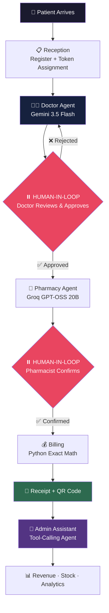
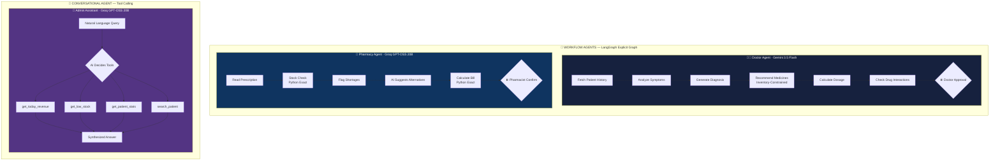

<h1 align="center">🏥 HMS AI</h1>

<h3 align="center">⚡ Engineered by <strong>Joyel J</strong> · Nagercoil, Tamil Nadu 🇮🇳</h3>

<br/>

<p align="center">
  
  
  
  
  
</p>

<p align="center">
  
  
  
  
  
</p>

<p align="center">
  
  
  
  
  
</p>

<p align="center">
  
  
  
  
  
</p>

---

> 🏥 **HMS AI** is a production-grade, AI-powered Hospital Management System built on **Multi-Agent LangGraph Orchestration**. It combines **Google Gemini 3.5 Flash** for medical reasoning and **Groq GPT-OSS** for high-speed operations to autonomously generate diagnoses, prescriptions, drug-interaction checks, stock verification and billing — with **mandatory human approval** before any action is executed. Built for the 6,00,000+ small clinics across India that still run on paper registers. Engineered by **Joyel J** from Nagercoil, Tamil Nadu 🇮🇳.

---

## 📌 Table of Contents

- [🧠 System Architecture](#-system-architecture)
- [🤖 Agent Architecture](#-agent-architecture)
- [⚡ Features](#-features)
- [🔄 Patient Flow](#-patient-flow)
- [📦 Tech Stack](#-tech-stack)
- [🔬 Multi-Model Benchmarking](#-multi-model-benchmarking)
- [🔧 Installation](#-installation)
- [🚀 API Endpoints](#-api-endpoints)
- [🔐 Roles & Access Control](#-roles--access-control)
- [🛡️ AI Safety Design](#️-ai-safety-design)
- [💰 Plans & Pricing](#-plans--pricing)
- [🗺️ Roadmap](#️-roadmap)
- [📋 Development Progress](#-development-progress)
- [🤝 Contributing](#-contributing)
- [📄 License](#-license)

---

## 🧠 System Architecture



---

## 🤖 Agent Architecture

HMS AI uses **two distinct agent patterns** — chosen deliberately per use case.



### Why Two Patterns?

| Pattern | Used For | Why |
|---|---|---|
| **Explicit LangGraph** | Doctor Agent, Pharmacy Agent | Fixed steps, safety-critical, exact math, predictable, auditable |
| **Tool Calling** | Admin Assistant | Unpredictable questions, AI must decide which data to fetch |

> **Engineering principle:** AI handles *reasoning*. Python handles *money and dosage math*. Never let an LLM compute a patient's bill.

---

## ⚡ Features

### Core Features (Basic Plan)

| 🔖 Feature | 📝 Description |
|---|---|
| 🆔 **Unique Patient ID** | Auto-generated `P-0001` format IDs, scoped per clinic |
| 🔐 **Multi-Role Authentication** | JWT + bcrypt — Admin, Doctor, Receptionist, Pharmacist, Superadmin |
| 🏥 **Multi-Tenant Architecture** | One system, many clinics — full data isolation via `clinic_id` |
| 👤 **Patient Management** | Register, search by ID/phone/name, duplicate phone detection |
| 📋 **Appointment Queue** | Auto token numbering, live status (waiting → with_doctor → done) |
| 📝 **Visit Notes** | Complaint, diagnosis, notes, follow-up date — doctor role enforced |
| 💊 **Medicine Inventory** | Add, search, low-stock alerts, separate restock endpoint (`+=` not `=`) |
| 📜 **Smart Prescriptions** | Auto quantity = frequency × duration, timing, multi-medicine support |
| 💊 **Pharmacy Module** | Pending queue, editable quantity, extra medicines, auto stock reduction |
| 💰 **Billing System** | Registration + consultation + medicine total, discount support |
| 📊 **Clinic Settings** | Per-clinic configurable fees set by admin |
| 💳 **Payment Collection** | Cash / UPI / Card with daily revenue dashboard |
| 📥 **Data Export** | One-click Excel — 4 styled sheets, never lock a clinic's data in |
| 🔄 **Dual Role Support** | Admin doubles as Doctor — built for solo clinics |

### AI Features (Premium Plan)

| 🔖 Feature | 📝 Description |
|---|---|
| 🤖 **Doctor Agent** | LangGraph workflow: history → symptoms → diagnosis → prescription → interaction check |
| 💊 **Pharmacy Agent** | Stock verification, shortage flagging, AI alternative suggestions, exact billing |
| 🤖 **Admin Assistant** | Tool-calling agent — ask anything about revenue, stock, patients in plain language |
| ⏸️ **Human-in-Loop** | Every agent pauses for human approval — no AI action executes unsupervised |
| 💊 **Inventory-Constrained AI** | AI can ONLY prescribe from the clinic's own stock — zero-hallucination design |
| 🛡️ **Drug Interaction Check** | Every prescription screened before doctor approval |
| 🔀 **Multi-Model Routing** | Best model per task — benchmarked across 4 providers |
| 🔄 **Provider Fallback** | If primary provider fails, automatic fallback keeps the clinic running |
| 🔍 **Patient History RAG** | pgvector semantic search across visit history *(planned)* |
| 📷 **Lab Report Analysis** | Photo/PDF → AI extracts and interprets values *(planned)* |
| 📊 **Audit Trail** | Every AI suggestion + human decision logged for legal traceability |

---

## 🔄 Patient Flow

```
Reception → Doctor → Pharmacy → Billing
```

| Step | Action | Who | AI Involvement |
|---|---|---|---|
| 1️⃣ | Patient registered / looked up | Receptionist | — |
| 2️⃣ | Token assigned, queued | Receptionist | Auto token system |
| 3️⃣ | Doctor types symptoms | Doctor | 🤖 Doctor Agent generates full prescription |
| 4️⃣ | Doctor reviews suggestion | Doctor | ⏸️ **Approve / Edit / Reject** |
| 5️⃣ | Prescription reaches pharmacy | System | Automatic |
| 6️⃣ | Stock checked, bill computed | Pharmacist | 🤖 Pharmacy Agent |
| 7️⃣ | Pharmacist confirms dispense | Pharmacist | ⏸️ **Confirm** — stock reduces |
| 8️⃣ | Patient pays at reception | Receptionist | Python exact calculation |
| 9️⃣ | Admin queries the business | Admin | 🤖 Admin Assistant (tool calling) |

---

## 📦 Tech Stack

<p align="center">
  
  
  
  
  
  
  
  
  
  
  
  
  
  
  
  
  
  
</p>

| Layer | Technology | Purpose |
|---|---|---|
| **Backend** | FastAPI (Python 3.11) | High-performance async REST API |
| **Database** | PostgreSQL 18 | Patients, visits, prescriptions, inventory, billing |
| **Vector Store** | pgvector | Patient history embeddings for RAG |
| **ORM** | SQLAlchemy | Python ↔ database mapping |
| **Validation** | Pydantic | Request/response schema enforcement |
| **Auth** | JWT + bcrypt (4.0.1) | Token auth with role-based access control |
| **Frontend** | React + Tailwind CSS | Responsive multi-role dashboards |
| **AI — Reasoning** | Google Gemini 3.5 Flash | Medical diagnosis, prescription generation |
| **AI — Speed** | Groq GPT-OSS 20B / 120B | Stock checks, billing queries, admin assistant |
| **AI — Fallback** | OpenRouter (Ling Santé, DeepSeek) | Provider redundancy |
| **Agent Framework** | LangGraph | Stateful multi-step agent orchestration |
| **RAG Framework** | LangChain | Document intelligence, retrieval |
| **Export** | openpyxl | Styled 4-sheet Excel workbooks |
| **Deployment** | Docker + Cloudflare Tunnel | Containerized, TLS-secured, self-hosted |

---

## 🔬 Multi-Model Benchmarking

Four providers were benchmarked on identical medical and pharmacy prompts before selecting the production stack.

| Provider | Model | Latency | Quality | Verdict |
|---|---|---|---|---|
| **Groq** | `openai/gpt-oss-20b` | ~2s | ⭐⭐⭐⭐ | ✅ **Selected** — Pharmacy + Admin |
| **Groq** | `openai/gpt-oss-120b` | ~3s | ⭐⭐⭐⭐ | ✅ Heavy reasoning fallback |
| **Google** | `gemini-3.5-flash` | ~3s | ⭐⭐⭐⭐⭐ | ✅ **Selected** — Doctor Agent |
| **OpenRouter** | `ling-3.0-flash-sante` | ~4.9s | ⭐⭐⭐⭐⭐ | ✅ Medical fallback |
| **OpenRouter** | `deepseek-v4-flash` | ~10.9s | ⭐⭐⭐⭐ | ⚠️ Secondary fallback |
| **NVIDIA NIM** | `gemma-4-31b-it` | 60s+ | — | ❌ Rejected — cold-start too slow |

### Production Model Routing

```
👨‍⚕️ Doctor Agent      → Gemini 3.5 Flash    (best clinical reasoning)
💊 Pharmacy Agent    → Groq GPT-OSS 20B    (fastest, simple logic)
🤖 Admin Assistant   → Groq GPT-OSS 20B    (fast tool calling)
🔄 Fallback #1       → OpenRouter Ling Santé (medical-tuned)
🔄 Fallback #2       → OpenRouter DeepSeek V4
```

> Gemini was chosen for the Doctor Agent after side-by-side testing showed superior clinical assessment — it correctly explained *why* antibiotics were **not** indicated for a viral presentation, added dosage ceilings, and included patient education. Groq was chosen everywhere speed matters more than clinical depth.

---

## 🔧 Installation

### Local Development

```bash
# 1️⃣ Clone the repository
git clone https://github.com/JoyelJames/clinicflow-ai.git
cd clinicflow-ai

# 2️⃣ Create and activate the conda environment
conda create -n clinicflow python=3.11
conda activate clinicflow

# 3️⃣ Install dependencies
pip install -r requirements.txt

# 4️⃣ Create the database
psql -U postgres -c "CREATE DATABASE hms_db;"

# 5️⃣ Configure environment variables
cp .env.example .env
# Add your DATABASE_URL, SECRET_KEY, GROQ_API_KEY, GOOGLE_API_KEY

# 6️⃣ Run the server
uvicorn app.main:app --reload

# 🌐 Interactive API docs:
# http://localhost:8000/docs
```

### Docker Deployment

```bash
# 🐳 Build the image
docker build -t hmsai:latest .

# 🚀 Start all services
docker-compose up -d

# 📋 Follow logs
docker-compose logs -f

# 🛑 Stop
docker-compose down
```

### Testing the AI Agents

```bash
# 👨‍⚕️ Doctor Agent — diagnosis + prescription
python app/agents/doctor_agent.py

# 💊 Pharmacy Agent — stock + billing
python app/agents/pharmacy_agent.py
```

---

## 🚀 API Endpoints

### 🔑 Authentication
```
POST   /auth/login                          Login → JWT token
```

### 👤 Patients
```
POST   /patients/register                   Register patient (auto P-0001, duplicate phone check)
GET    /patients/search?query=              Search by ID, phone, or name
GET    /patients/all                        All clinic patients (with calculated age)
```

### 📋 Appointments
```
POST   /appointments/book                   Book appointment (auto token, duplicate check)
GET    /appointments/today                  Today's queue ordered by token
PUT    /appointments/{id}/status            waiting → with_doctor → done
GET    /appointments/stats/today            Live counts per status
```

### 📝 Visits
```
POST   /visits/create                       Create visit note (doctor/admin only)
GET    /visits/patient/{patient_id}         Full visit history
GET    /visits/patient/{patient_id}/last2   Last 2 visits — fed to Doctor Agent
```

### 💊 Medicine Inventory
```
POST   /medicines/add                       Add medicine (admin/pharmacist)
GET    /medicines/all                       Active inventory
GET    /medicines/search?query=             Search by name
GET    /medicines/low-stock                 stock_quantity <= low_stock_alert
PUT    /medicines/{id}/update               Update name, unit, price
PUT    /medicines/{id}/restock              Add to existing stock (+=)
```

### 📜 Prescriptions
```
POST   /prescriptions/create                Auto quantity = frequency × duration
GET    /prescriptions/patient/{patient_id}  Patient prescription history
GET    /prescriptions/pending               Pending queue for pharmacy
```

### 💊 Pharmacy
```
GET    /pharmacy/pending                    Waiting patients
GET    /pharmacy/prescription/{id}          Details + in_stock flags + prices
POST   /pharmacy/dispense/{id}              Edit quantity, add extras, reduce stock
```

### 💰 Billing
```
POST   /billing/create                      Registration + consultation + medicines − discount
POST   /billing/{bill_id}/pay               Collect payment (cash/upi/card)
GET    /billing/pending                     Unpaid bills
GET    /billing/today/revenue               Daily revenue dashboard
```

### 📊 Admin
```
POST   /admin/staff/create                  Create staff (role validated, unique per clinic)
GET    /admin/staff/all                     All clinic staff
PUT    /admin/staff/{id}/deactivate         Soft-delete staff (cannot self-deactivate)
POST   /admin/settings/fees                 Configure clinic fees
```

### 👑 Superadmin
```
POST   /superadmin/clinic/create            Create clinic + its admin atomically
GET    /superadmin/clinics/all              All clinics
PUT    /superadmin/clinic/{id}/deactivate   Deactivate a clinic
```

### 📥 Export
```
GET    /export/all                          Excel — Patients, Visits, Prescriptions, Bills
```

### 🤖 AI Agents
```
POST   /ai/doctor/generate                  Doctor Agent — symptoms → prescription
POST   /ai/pharmacy/process/{id}            Pharmacy Agent — stock check + bill
POST   /ai/admin/ask                        Admin Assistant — natural language queries
```

---

## 🔐 Roles & Access Control

| Action | 👩‍💼 Receptionist | 👨‍⚕️ Doctor | 💊 Pharmacist | 🏥 Admin | 👑 Superadmin |
|---|---|---|---|---|---|
| Register patient | ✅ | ✅ | ❌ | ✅ | ❌ |
| Book appointment | ✅ | ✅ | ❌ | ✅ | ❌ |
| Write visit notes | ❌ | ✅ | ❌ | ✅ | ❌ |
| Create prescription | ❌ | ✅ | ❌ | ✅ | ❌ |
| Use Doctor Agent | ❌ | ✅ | ❌ | ✅ | ❌ |
| Add / restock medicines | ❌ | ❌ | ✅ | ✅ | ❌ |
| Dispense medicines | ❌ | ❌ | ✅ | ✅ | ❌ |
| Use Pharmacy Agent | ❌ | ❌ | ✅ | ✅ | ❌ |
| Collect payment | ✅ | ❌ | ❌ | ✅ | ❌ |
| Manage staff | ❌ | ❌ | ❌ | ✅ | ❌ |
| Set clinic fees | ❌ | ❌ | ❌ | ✅ | ❌ |
| Use Admin Assistant | ❌ | ❌ | ❌ | ✅ | ✅ |
| Export data | ❌ | ❌ | ❌ | ✅ | ✅ |
| Create / manage clinics | ❌ | ❌ | ❌ | ❌ | ✅ |

---

## 🛡️ AI Safety Design

```
🔒 NON-NEGOTIABLE RULES — enforced in every agent:

 1. AI SUGGESTS. Human DECIDES. Always. No exceptions.
 2. Doctor Agent prescribes ONLY from the clinic's own inventory.
 3. A medicine not in stock is NEVER suggested as a primary.
 4. Drug interaction screening runs on every generated prescription.
 5. temperature = 0.1 on all medical prompts — factual, not creative.
 6. Python — never the LLM — computes money and dosage arithmetic.
 7. Every AI suggestion and human decision is written to an audit trail.
 8. Pharmacist may override any AI-suggested quantity.
 9. No prescription reaches the pharmacy without explicit doctor approval.
10. Agents call the authenticated REST API — never the database directly.
```

### Why Agents Never Touch the Database

Agents call the same JWT-protected API endpoints the frontend uses. This means every agent request passes through **token verification → role check → `clinic_id` isolation** before any data is returned. An agent cannot read another clinic's patients even if its prompt is compromised.

### Human-in-Loop Flow

```
🤖 Agent generates suggestion
        ↓
⏸️ GRAPH PAUSES — execution halts
        ↓
👨‍⚕️ Human reviews on screen
        ↓
   [✏️ Edit]   [❌ Reject]   [✅ Approve]
        ↓
✅ Action executes only after approval
        ↓
📋 Decision written to audit log
```

---

## 💰 Plans & Pricing

| Feature | Basic ₹2,000/mo | Premium ₹3,000/mo |
|---|---|---|
| Full HMS | ✅ | ✅ |
| Multi-role authentication | ✅ | ✅ |
| Patient management | ✅ | ✅ |
| Appointment queue | ✅ | ✅ |
| Visit notes | ✅ | ✅ |
| Medicine inventory | ✅ | ✅ |
| Prescription management | ✅ | ✅ |
| Pharmacy module | ✅ | ✅ |
| Billing + payment | ✅ | ✅ |
| Excel data export | ✅ | ✅ |
| 🤖 Doctor Agent | ❌ | ✅ |
| 💊 Pharmacy Agent | ❌ | ✅ |
| 🤖 Admin Assistant | ❌ | ✅ |
| 🛡️ Drug interaction check | ❌ | ✅ |
| 💊 Inventory-constrained AI | ❌ | ✅ |
| 🔍 Patient history RAG | ❌ | ✅ |
| 📷 Lab report analysis | ❌ | ✅ |

---

## 🗺️ Roadmap

### Phase 1 — Core HMS ✅ Complete
- [x] Project setup, PostgreSQL, environment config
- [x] Patient, User, Clinic, Appointment, Visit, Medicine models
- [x] JWT + bcrypt authentication with role-based access
- [x] Patient management — register, search, duplicate detection
- [x] Appointment queue with auto token numbering
- [x] Visit notes with doctor-role enforcement
- [x] Medicine inventory with low-stock alerts and restock endpoint
- [x] Prescriptions with auto quantity calculation
- [x] Pharmacy module with editable quantity and stock reduction
- [x] Billing with auto fee calculation and payment collection
- [x] Excel data export — 4 styled sheets
- [x] Admin + Superadmin management

### Phase 2 — AI Agents 🔨 In Progress
- [x] Multi-provider benchmarking — Groq, Gemini, NVIDIA, OpenRouter
- [x] Production model routing decided
- [x] **Doctor Agent** — LangGraph, Gemini 3.5 Flash, inventory-constrained
- [x] **Pharmacy Agent** — LangGraph, Groq, hybrid Python/AI design
- [ ] **Admin Assistant** — tool-calling agent for natural language queries
- [ ] Agent ↔ API integration with real database and JWT
- [ ] Audit trail table for every AI decision

### Phase 3 — Frontend
- [ ] React + Tailwind setup
- [ ] Login + Reception dashboard
- [ ] Doctor dashboard with AI prescription review UI
- [ ] Pharmacy + Billing dashboards
- [ ] Admin panel with embedded AI chat

### Phase 4 — Deployment
- [ ] Docker containerization
- [ ] Cloudflare Tunnel + HTTPS
- [ ] End-to-end testing and polish
- [ ] First clinic onboarding

### Future
- [ ] 🔮 ICD-11 + TM2 (AYUSH) code integration
- [ ] 🔮 pgvector RAG over full patient history
- [ ] 🔮 Lab report image analysis (Gemini multimodal)
- [ ] 🔮 n8n automation — WhatsApp reminders, scheduled reports
- [ ] 🔮 QR code prescriptions
- [ ] 🔮 Mobile-responsive PWA
- [ ] 🔮 Multi-facility platform expansion

---

## 📋 Development Progress

| Day | Module | Status |
|---|---|---|
| 1 | Project setup + PostgreSQL | ✅ Complete |
| 2 | Models — Patient, User, Clinic | ✅ Complete |
| 3 | Pydantic schemas | ✅ Complete |
| 4 | Security — bcrypt + JWT | ✅ Complete |
| 5 | Login endpoint | ✅ Complete |
| 6 | Patient router | ✅ Complete |
| 7 | Admin router | ✅ Complete |
| 8 | Superadmin router | ✅ Complete |
| 9 | Appointment router + token queue | ✅ Complete |
| 10 | Visit notes | ✅ Complete |
| 11 | Medicine inventory + restock | ✅ Complete |
| 12 | Prescriptions + auto quantity | ✅ Complete |
| 13 | Pharmacy module | ✅ Complete |
| 14 | Billing + clinic settings | ✅ Complete |
| 15 | Excel data export | ✅ Complete |
| 16 | Multi-model testing + **Doctor Agent** | ✅ Complete |
| 17 | Provider benchmarking + **Pharmacy Agent** | ✅ Complete |
| 18 | Admin Assistant — tool calling | 🔨 Next |
| 19 | Agent ↔ API integration | 📋 Planned |
| 20–24 | React frontend — all dashboards | 📋 Planned |
| 25–28 | Docker + deploy + testing | 📋 Planned |

---

## 🤝 Contributing

Pull requests are welcome. For significant changes, please open an issue first to discuss the direction.

```bash
# 🍴 Fork & clone
git clone https://github.com/YOUR_USERNAME/clinicflow-ai.git
cd clinicflow-ai

# 🌿 Create a feature branch
git checkout -b feature/your-feature-name

# 💾 Commit
git add .
git commit -m "feat: add your feature description"

# 📤 Push and open a PR
git push origin feature/your-feature-name
```

Maintained by **Joyel J**

[](https://github.com/JoyelJames)
[](https://linkedin.com/in/joyel-j-793859339)
[](https://instagram.com/neura_insights)

---

## 📄 License

| License | Use Case | Details |
|---------|----------|---------|
| [](https://choosealicense.com/licenses/mit/) | Personal & Open Source | Free to use, modify, and distribute with attribution |

> Distributed under the **MIT License**. See the `LICENSE` file for full terms.

---

<p align="center">
  <strong>🏥 HMS AI — AI-Powered Hospital Management System</strong><br/>
  <em>Built in Nagercoil, Tamil Nadu 🇮🇳</em><br/>
  <em>Replacing paper registers with intelligent systems.</em><br/><br/>
  <strong>Engineered by Joyel J</strong><br/>
  <em>AI suggests. Human decides. Patient stays safe. ⏸️ ✅</em>
</p>
