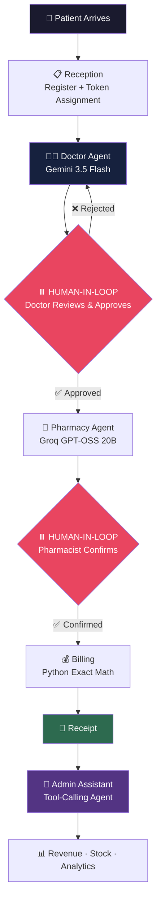
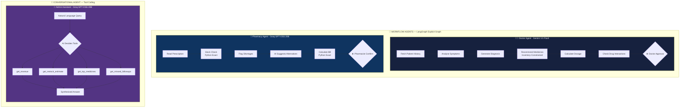

<h1 align="center">🏥 HMS AI</h1>

<h3 align="center">⚡ Engineered by <strong>Joyel J</strong> · Nagercoil, Tamil Nadu 🇮🇳</h3>

<p align="center">
  <a href="https://hms.joyel.online">
    
  </a>
</p>

<p align="center">
  <strong>Try it now →</strong> &nbsp; username <code>demo</code> &nbsp;·&nbsp; password <code>demo123</code>
</p>

<br/>

<p align="center">
  
  
  
  
  
</p>

<p align="center">
  
  
  
  
  
</p>

<p align="center">
  
  
  
  
  
</p>

<p align="center">
  
  
  
  
  
</p>

---

> 🏥 **HMS AI** is a production AI-powered Hospital Management System built on **multi-agent LangGraph orchestration**. It pairs **Google Gemini 3.5 Flash** for medical reasoning with **Groq GPT-OSS** for high-speed operations to generate diagnoses, prescriptions, drug-interaction checks, stock verification and billing — with **mandatory human approval before any action executes**. Built for the 600,000+ small clinics across India that still run on paper registers, and **deployed live on self-hosted hardware** at ₹0/month.

---

## 📌 Table of Contents

- [🩺 The Problem](#-the-problem)
- [🧠 System Architecture](#-system-architecture)
- [🤖 Agent Architecture](#-agent-architecture)
- [⚡ Features](#-features)
- [🔄 Patient Flow](#-patient-flow)
- [📦 Tech Stack](#-tech-stack)
- [🔬 Multi-Model Benchmarking](#-multi-model-benchmarking)
- [🖥️ Production Deployment](#️-production-deployment)
- [🔧 Installation](#-installation)
- [🚀 API Endpoints](#-api-endpoints)
- [🔐 Roles & Access Control](#-roles--access-control)
- [🛡️ AI Safety Design](#️-ai-safety-design)
- [💰 Plans & Pricing](#-plans--pricing)
- [🗺️ Roadmap](#️-roadmap)
- [🤝 Contributing](#-contributing)
- [📄 License](#-license)

---

## 🩺 The Problem

India has over **600,000 small clinics**. Roughly **80% still run on paper** — patient records in notebooks, prescriptions on carbon copies, stock counted by hand.

Enterprise hospital software costs **₹8,000–20,000/month** and is designed for 200-bed hospitals. Nothing exists for a two-room clinic with one doctor and one receptionist.

HMS AI is built for that clinic.

---

## 🧠 System Architecture


```mermaid
flowchart TD
    A[👤 Patient Arrives] --> B[📋 Reception<br/>Register + Token Assignment]
    B --> C[👨‍⚕️ Doctor Agent<br/>Gemini 3.5 Flash]
    C --> D{⏸️ HUMAN-IN-LOOP<br/>Doctor Reviews & Approves}
    D -->|❌ Rejected| C
    D -->|✅ Approved| E[💊 Pharmacy Agent<br/>Groq GPT-OSS 20B]
    E --> F{⏸️ HUMAN-IN-LOOP<br/>Pharmacist Confirms}
    F -->|✅ Confirmed| G[💰 Billing<br/>Python Exact Math]
    G --> H[📄 Receipt]
    H --> I[🤖 Admin Assistant<br/>Tool-Calling Agent]
    I --> J[📊 Revenue · Stock · Analytics]

    style A fill:#1a1a2e,color:#fff
    style C fill:#16213e,color:#fff
    style D fill:#e94560,color:#fff
    style F fill:#e94560,color:#fff
    style H fill:#2d6a4f,color:#fff
    style I fill:#533483,color:#fff
```

---

## 🤖 Agent Architecture

HMS AI uses **two distinct agent patterns** — chosen deliberately per use case.


```mermaid
flowchart TB
    subgraph W["🔄 WORKFLOW AGENTS — LangGraph Explicit Graph"]
        direction TB
        subgraph DA["👨‍⚕️ Doctor Agent · Gemini 3.5 Flash"]
            D1[Fetch Patient History] --> D2[Analyse Symptoms]
            D2 --> D3[Generate Diagnosis]
            D3 --> D4[Recommend Medicines<br/>Inventory-Constrained]
            D4 --> D5[Calculate Dosage]
            D5 --> D6[Check Drug Interactions]
            D6 --> D7{⏸️ Doctor Approval}
        end
        subgraph PA["💊 Pharmacy Agent · Groq GPT-OSS 20B"]
            P1[Read Prescription] --> P2[Stock Check<br/>Python Exact]
            P2 --> P3[Flag Shortages]
            P3 --> P4[AI Suggests Alternatives]
            P4 --> P5[Calculate Bill<br/>Python Exact]
            P5 --> P6{⏸️ Pharmacist Confirm}
        end
    end

    subgraph C["💬 CONVERSATIONAL AGENT — Tool Calling"]
        subgraph AA["🤖 Admin Assistant · Groq GPT-OSS 20B"]
            A1[Natural Language Query] --> A2{AI Decides Tools}
            A2 --> A3[get_revenue]
            A2 --> A4[get_restock_estimate]
            A2 --> A5[get_top_medicines]
            A2 --> A6[get_missed_followups]
            A3 --> A7[Synthesised Answer]
            A4 --> A7
            A5 --> A7
            A6 --> A7
        end
    end

    style DA fill:#16213e,color:#fff
    style PA fill:#0f3460,color:#fff
    style AA fill:#533483,color:#fff
```

### Why Two Patterns?

| Pattern | Used For | Why |
|---|---|---|
| **Explicit LangGraph** | Doctor Agent, Pharmacy Agent | Fixed steps, safety-critical, exact math, predictable, auditable |
| **Tool Calling** | Admin Assistant | Unpredictable questions — the AI must decide which data to fetch |

> **Engineering principle:** AI handles *reasoning*. Python handles *money and dosage math*. Never let an LLM compute a patient's bill.

**The Admin Assistant in action.** Ask *"What stock do I need to refill and can I afford it?"* and the agent independently calls `get_restock_estimate()`, then `get_top_medicines()`, then `get_revenue()` — three queries that were never scripted — and returns a prioritised recommendation with costs weighed against monthly income.

---

## ⚡ Features

### Core Features (Basic Plan)

| 🔖 Feature | 📝 Description |
|---|---|
| 🆔 **Unique Patient ID** | Auto-generated `P-0001` format IDs, scoped per clinic |
| 🔐 **Multi-Role Authentication** | JWT + bcrypt — Admin, Doctor, Receptionist, Pharmacist, Superadmin |
| 🏥 **Multi-Tenant Architecture** | One system, many clinics — full data isolation via `clinic_id` |
| 👤 **Patient Management** | Register, search by ID/phone/name, duplicate phone detection |
| 📋 **Appointment Queue** | Auto token numbering, live status (waiting → with_doctor → done) |
| 📝 **Visit Notes** | Complaint, diagnosis, notes, follow-up date — doctor role enforced |
| 💊 **Medicine Inventory** | Add, search, low-stock alerts, separate restock endpoint (`+=` not `=`) |
| 📜 **Smart Prescriptions** | Auto quantity = frequency × duration, timing, multi-medicine support |
| 💊 **Pharmacy Module** | Pending queue, editable quantity, extra medicines, auto stock reduction |
| 💰 **Billing System** | Registration + consultation + medicine total, discount support |
| 📊 **Clinic Settings** | Per-clinic configurable fees set by admin |
| 💳 **Payment Collection** | Cash / UPI / Card with daily revenue dashboard |
| 📥 **Data Export** | One-click Excel — 4 styled sheets, never lock a clinic's data in |
| 🔄 **Dual Role Support** | Admin doubles as Doctor — built for solo clinics |

### AI Features (Premium Plan)

| 🔖 Feature | 📝 Description |
|---|---|
| 🤖 **Doctor Agent** | LangGraph workflow: history → symptoms → diagnosis → prescription → interaction check |
| 💊 **Pharmacy Agent** | Stock verification, shortage flagging, AI alternative suggestions, exact billing |
| 🤖 **Admin Assistant** | 11 flexible tools, conversation memory, multi-step autonomous reasoning |
| ⏸️ **Human-in-Loop** | Every agent pauses for approval — no AI action executes unsupervised |
| 💊 **Inventory-Constrained AI** | AI can ONLY prescribe from the clinic's own stock — zero-hallucination design |
| 🛡️ **Drug Interaction Check** | Every prescription screened before doctor approval |
| 🔀 **Multi-Model Routing** | Best model per task — benchmarked across 4 providers |
| 🔄 **Provider Fallback** | If the primary provider fails, automatic fallback keeps the clinic running |
| 🔍 **Patient History RAG** | pgvector semantic search across visit history *(planned)* |
| 📷 **Lab Report Analysis** | Photo/PDF → AI extracts and interprets values *(planned)* |

---

## 🔄 Patient Flow

```
Reception → Doctor → Pharmacy → Billing
```

| Step | Action | Who | AI Involvement |
|---|---|---|---|
| 1️⃣ | Patient registered / looked up | Receptionist | — |
| 2️⃣ | Token assigned, queued | Receptionist | Auto token system |
| 3️⃣ | Doctor types symptoms | Doctor | 🤖 Doctor Agent generates full prescription |
| 4️⃣ | Doctor reviews suggestion | Doctor | ⏸️ **Approve / Edit / Reject** |
| 5️⃣ | Prescription reaches pharmacy | System | Automatic |
| 6️⃣ | Stock checked, bill computed | Pharmacist | 🤖 Pharmacy Agent |
| 7️⃣ | Pharmacist confirms dispense | Pharmacist | ⏸️ **Confirm** — stock reduces |
| 8️⃣ | Patient pays at reception | Receptionist | Python exact calculation |
| 9️⃣ | Admin queries the business | Admin | 🤖 Admin Assistant (tool calling) |

---

## 📦 Tech Stack

<p align="center">
  
  
  
  
  
  
  
  
  
  
  
  
  
  
  
  
  
  
</p>

| Layer | Technology | Purpose |
|---|---|---|
| **Backend** | FastAPI (Python 3.11) | High-performance async REST API |
| **Database** | PostgreSQL 18 | Patients, visits, prescriptions, inventory, billing |
| **Vector Store** | pgvector | Patient history embeddings for RAG |
| **ORM** | SQLAlchemy | Python ↔ database mapping |
| **Validation** | Pydantic | Request/response schema enforcement |
| **Auth** | JWT + bcrypt | Token auth with role-based access control |
| **Frontend** | React + Tailwind CSS | 5 responsive role-based dashboards |
| **Web Server** | Nginx | Static serving + `/api` reverse proxy |
| **AI — Reasoning** | Google Gemini 3.5 Flash | Medical diagnosis, prescription generation |
| **AI — Speed** | Groq GPT-OSS 20B / 120B | Stock checks, billing queries, admin assistant |
| **AI — Fallback** | OpenRouter (Ling Santé, DeepSeek) | Provider redundancy |
| **Agent Framework** | LangGraph | Stateful multi-step agent orchestration |
| **RAG Framework** | LangChain | Document intelligence, retrieval |
| **Export** | openpyxl | Styled 4-sheet Excel workbooks |
| **Deployment** | Docker Compose + Cloudflare Tunnel | Containerised, TLS-secured, self-hosted |
| **OS** | Ubuntu Server 26.04 LTS | UFW · Fail2ban · cron · SSH keys |

---

## 🔬 Multi-Model Benchmarking

Four providers were benchmarked on identical medical and pharmacy prompts before selecting the production stack.

| Provider | Model | Latency | Quality | Verdict |
|---|---|---|---|---|
| **Google** | `gemini-3.5-flash` | ~3s | ⭐⭐⭐⭐⭐ | ✅ **Selected** — Doctor Agent |
| **Groq** | `openai/gpt-oss-20b` | ~2s | ⭐⭐⭐⭐ | ✅ **Selected** — Pharmacy + Admin |
| **Groq** | `openai/gpt-oss-120b` | ~3s | ⭐⭐⭐⭐ | ✅ Heavy-reasoning fallback |
| **OpenRouter** | `ling-3.0-flash-sante` | ~4.9s | ⭐⭐⭐⭐⭐ | ✅ Medical-tuned fallback |
| **OpenRouter** | `deepseek-v4-flash` | ~10.9s | ⭐⭐⭐⭐ | ⚠️ Secondary fallback |
| **NVIDIA NIM** | `gemma-4-31b-it` | 60s+ | — | ❌ Rejected — cold starts too slow |

### Production Model Routing

```
👨‍⚕️ Doctor Agent      → Gemini 3.5 Flash      (best clinical reasoning)
💊 Pharmacy Agent    → Groq GPT-OSS 20B      (fastest, simple logic)
🤖 Admin Assistant   → Groq GPT-OSS 20B      (fast tool calling)
🔄 Fallback #1       → OpenRouter Ling Santé (medical-tuned)
🔄 Fallback #2       → OpenRouter DeepSeek V4
```

> Gemini won the Doctor Agent on a side-by-side test: it correctly explained *why* antibiotics were **not** indicated for a viral presentation, added dosage ceilings, and included patient education. Groq won everywhere speed matters more than clinical depth.

---

## 🖥️ Production Deployment

HMS AI runs **live on a repurposed HP laptop**, self-hosted at **₹0/month**.

```
                    🌍 Visitor
                        ↓
            https://hms.joyel.online
                        ↓
         ☁️  CLOUDFLARE — TLS · IP masking · DDoS
                        ↓
      ↑ outbound tunnel — zero inbound ports open ↑
                        ↓
    ┌────────────────────────────────────────────┐
    │  Ubuntu Server 26.04 LTS                    │
    │  🔥 UFW (deny-by-default)  🛡️ Fail2ban      │
    │  🔑 SSH keys only · root login disabled     │
    │                                             │
    │  ┌───────────────────────────────────────┐ │
    │  │  Docker Compose                        │ │
    │  │    hms-frontend  Nginx  →  :8080  ✅   │ │
    │  │    hms-backend   FastAPI  (internal)   │ │
    │  │    hms-db        Postgres (internal)   │ │
    │  └───────────────────────────────────────┘ │
    │                                             │
    │  🗄️ Nightly pg_dump · gzip · 14-day retention│
    └────────────────────────────────────────────┘
```

**Security posture**

| Layer | Control |
|---|---|
| **Firewall** | UFW deny-by-default; SSH and app ports scoped to LAN only |
| **SSH** | Key authentication only — passwords disabled, root login blocked |
| **Intrusion** | Fail2ban bans an IP after 5 failed attempts |
| **Container isolation** | Backend and database publish **no host ports** — unreachable even from the LAN |
| **Ingress** | Cloudflare Tunnel dials outbound; no inbound port is opened at all |
| **Backups** | Automated nightly `pg_dump`, gzipped, 14-day rotation via cron |
| **Resilience** | Survives reboots unattended — containers and tunnel restart automatically |

---

## 🔧 Installation

### Docker (recommended)

```bash
# 1️⃣ Clone
git clone https://github.com/Joyeljames/hms_ai.git
cd hms_ai

# 2️⃣ Configure secrets
cp .env.example .env
# Add DATABASE_URL, SECRET_KEY, GROQ_API_KEY, GOOGLE_API_KEY

# 3️⃣ Build and run
docker compose up -d --build

# 🌐 Open http://localhost:8080
```

### Useful commands

```bash
docker compose ps                    # container status
docker compose logs -f backend       # follow backend logs
docker compose up -d --build         # rebuild after changes
docker compose down                  # stop (data preserved)
```

---

## 🚀 API Endpoints

<details>
<summary><strong>Expand full endpoint reference</strong></summary>

### 🔑 Authentication
```
POST   /auth/login                          Login → JWT token
```


## 🔐 Roles & Access Control

| Action | 👩‍💼 Receptionist | 👨‍⚕️ Doctor | 💊 Pharmacist | 🏥 Admin | 👑 Superadmin |
|---|:---:|:---:|:---:|:---:|:---:|
| Register patient | ✅ | ✅ | ❌ | ✅ | ❌ |
| Book appointment | ✅ | ✅ | ❌ | ✅ | ❌ |
| Write visit notes | ❌ | ✅ | ❌ | ✅ | ❌ |
| Create prescription | ❌ | ✅ | ❌ | ✅ | ❌ |
| Use Doctor Agent | ❌ | ✅ | ❌ | ✅ | ❌ |
| Add / restock medicines | ❌ | ❌ | ✅ | ✅ | ❌ |
| Dispense medicines | ❌ | ❌ | ✅ | ✅ | ❌ |
| Use Pharmacy Agent | ❌ | ❌ | ✅ | ✅ | ❌ |
| Collect payment | ✅ | ❌ | ❌ | ✅ | ❌ |
| Manage staff | ❌ | ❌ | ❌ | ✅ | ❌ |
| Set clinic fees | ❌ | ❌ | ❌ | ✅ | ❌ |
| Use Admin Assistant | ❌ | ❌ | ❌ | ✅ | ✅ |
| Export data | ❌ | ❌ | ❌ | ✅ | ✅ |
| Create / manage clinics | ❌ | ❌ | ❌ | ❌ | ✅ |

> In a one-person clinic the admin holds every tab — a design decision made after talking to a doctor who is also his own receptionist and pharmacist.

---

## 🛡️ AI Safety Design

```
🔒 NON-NEGOTIABLE RULES — enforced in every agent:

 1. AI SUGGESTS. Human DECIDES. Always. No exceptions.
 2. Doctor Agent prescribes ONLY from the clinic's own inventory.
 3. A medicine not in stock is NEVER suggested as a primary.
 4. Drug interaction screening runs on every generated prescription.
 5. temperature = 0.1 on all medical prompts — factual, not creative.
 6. Python — never the LLM — computes money and dosage arithmetic.
 7. Every AI suggestion and human decision is written to an audit trail.
 8. Pharmacist may override any AI-suggested quantity.
 9. No prescription reaches the pharmacy without explicit doctor approval.
10. Agents run inside authenticated endpoints — never raw database access.
```

### Hallucinations Are Filtered Twice

The prompt constrains the AI to the clinic's inventory list. Then the endpoint independently verifies **every returned medicine name** against the real database before saving. Anything invented is silently dropped and reported back as `rejected_hallucinations`.

### Why Agents Never Get Raw Database Access

Every agent executes inside an endpoint that has already verified the JWT, checked the role, and extracted `clinic_id`. An agent cannot read another clinic's patients **even if its prompt were compromised** — the tenant boundary is bound at the endpoint, not chosen by the model.

### Human-in-Loop Flow

```
🤖 Agent generates suggestion
        ↓
⏸️ GRAPH PAUSES — execution halts
        ↓
👨‍⚕️ Human reviews on screen
        ↓
   [✏️ Edit]   [❌ Reject]   [✅ Approve]
        ↓
✅ Action executes only after approval
        ↓
📋 Decision written to audit log
```

---

## 💰 Plans & Pricing

| Feature | Basic ₹2,000/mo | Premium ₹3,000/mo |
|---|:---:|:---:|
| Full HMS | ✅ | ✅ |
| Multi-role authentication | ✅ | ✅ |
| Patient management | ✅ | ✅ |
| Appointment queue | ✅ | ✅ |
| Visit notes | ✅ | ✅ |
| Medicine inventory | ✅ | ✅ |
| Prescription management | ✅ | ✅ |
| Pharmacy module | ✅ | ✅ |
| Billing + payment | ✅ | ✅ |
| Excel data export | ✅ | ✅ |
| 🤖 Doctor Agent | ❌ | ✅ |
| 💊 Pharmacy Agent | ❌ | ✅ |
| 🤖 Admin Assistant | ❌ | ✅ |
| 🛡️ Drug interaction check | ❌ | ✅ |
| 💊 Inventory-constrained AI | ❌ | ✅ |
| 🔍 Patient history RAG | ❌ | ✅ |
| 📷 Lab report analysis | ❌ | ✅ |

---

## 🗺️ Roadmap

### Phase 1 — Core HMS ✅ Complete
- [x] PostgreSQL schema, models, Pydantic validation
- [x] JWT + bcrypt authentication with role-based access
- [x] Patient management — register, search, duplicate detection
- [x] Appointment queue with auto token numbering
- [x] Visit notes with doctor-role enforcement
- [x] Medicine inventory with low-stock alerts and restock endpoint
- [x] Prescriptions with auto quantity calculation
- [x] Pharmacy module with editable quantity and stock reduction
- [x] Billing with auto fee calculation and payment collection
- [x] Excel data export — 4 styled sheets
- [x] Admin + Superadmin management

### Phase 2 — AI Agents ✅ Complete
- [x] Multi-provider benchmarking — Groq, Gemini, NVIDIA, OpenRouter
- [x] Production model routing decided
- [x] **Doctor Agent** — LangGraph, Gemini 3.5 Flash, inventory-constrained
- [x] **Pharmacy Agent** — LangGraph, Groq, hybrid Python/AI design
- [x] **Admin Assistant** — tool-calling, 11 tools, conversation memory
- [x] Agent ↔ API integration with real database and JWT
- [x] Double-layer hallucination filtering

### Phase 3 — Frontend ✅ Complete
- [x] React + Tailwind setup with protected routes
- [x] Login + animated splash screen
- [x] Reception dashboard — debounced search, registration, token queue
- [x] Doctor dashboard — AI prescription review and editing
- [x] Pharmacy dashboard — stock verification and dispensing
- [x] Billing panel — bill generation and payment collection
- [x] Admin panel — AI chat, inventory, staff, settings

### Phase 4 — Deployment ✅ Complete
- [x] Docker containerisation — multi-stage builds, healthchecks
- [x] Ubuntu Server hardening — UFW, Fail2ban, SSH keys
- [x] Nginx reverse proxy with `/api` routing
- [x] Cloudflare Tunnel — public HTTPS, custom domain
- [x] Automated nightly database backups
- [x] **Live at [hms.joyel.online](https://hms.joyel.online)**

### Phase 5 — Next
- [ ] 🔮 Automated test suite — pytest + Playwright
- [ ] 🔮 ICD-11 + TM2 (AYUSH) code integration via the WHO API
- [ ] 🔮 pgvector RAG over full patient history
- [ ] 🔮 Lab report image analysis (Gemini multimodal)
- [ ] 🔮 n8n automation — WhatsApp reminders, scheduled reports
- [ ] 🔮 QR code prescriptions
- [ ] 🔮 Mobile-responsive PWA
- [ ] 🔮 Multi-facility platform expansion

---

## 🤝 Contributing

Pull requests are welcome. For significant changes, please open an issue first to discuss the direction.

```bash
# 🍴 Fork & clone
git clone https://github.com/YOUR_USERNAME/hms_ai.git
cd hms_ai

# 🌿 Create a feature branch
git checkout -b feature/your-feature-name

# 💾 Commit
git add .
git commit -m "feat: add your feature description"

# 📤 Push and open a PR
git push origin feature/your-feature-name
```

Designed, built and deployed solo by **Joyel J**

[](https://github.com/Joyeljames)
[](https://linkedin.com/in/joyel-j-793859339)
[](https://instagram.com/neura_insights)

---

## 📄 License

| License | Use Case | Details |
|---------|----------|---------|
| [](https://choosealicense.com/licenses/mit/) | Personal & Open Source | Free to use, modify, and distribute with attribution |

> Distributed under the **MIT License**. See the `LICENSE` file for full terms.

---

<p align="center">
  <strong>🏥 HMS AI — AI-Powered Hospital Management System</strong><br/>
  <a href="https://hms.joyel.online"><strong>hms.joyel.online</strong></a> &nbsp;·&nbsp; <code>demo</code> / <code>demo123</code><br/><br/>
  <em>Built in Nagercoil, Tamil Nadu 🇮🇳</em><br/>
  <em>Replacing paper registers with intelligent systems.</em><br/><br/>
  <strong>Engineered by Joyel J</strong><br/>
  <em>AI suggests. Human decides. Patient stays safe. ⏸️ ✅</em>
</p>